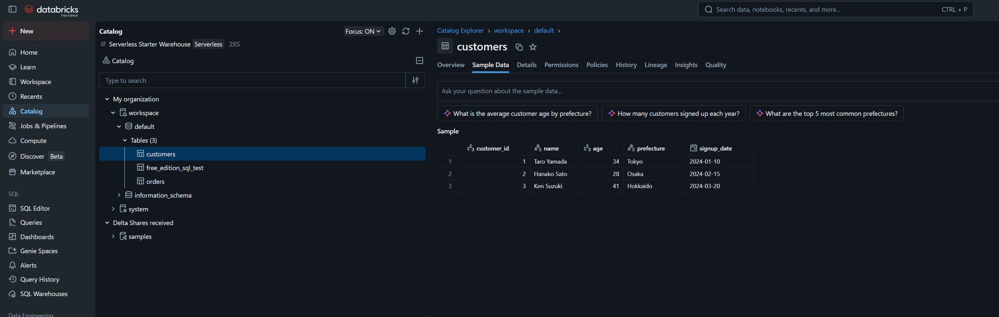

# study-databricks-pipeline

ローカル CSV を **GCS → Cloud Run Jobs → Databricks Managed Volume → Databricks Table** という GCP 経由のパイプラインで取り込む学習リポジトリ。前身 [`study-databricks-import`](../study-databricks-import/)(ローカルから Files API で直接 Volume に上げ、`read_files()` + MATERIALIZED VIEW)を拡張し、GCS / Cloud Run 連携と実テーブル取込(COPY INTO)を足したもの。

Databricks 側は **Free Edition** を前提にする(catalog は `workspace` 固定、external location / external volume は使えない)。GCS を直接マウントできないため、**Cloud Run Job が「GCS からダウンロード → Files API で Managed Volume へ upload」を仲介** する。

## 想定フロー

```text
ローカル CSV (data/*.csv)
  ── make gcs-upload ──▶ GCS  gs://<bucket>/incoming/*.csv
  ── Cloud Run Job (csv-to-volume) ──▶ Managed Volume /Volumes/workspace/default/raw_csv/
  ── COPY INTO (SQL Warehouse) ──▶ Databricks Table workspace.default.customers
```

## クイックスタート

```bash
make install                                   # .venv 作成 + pip install -e .

# ── Phase 1: GCS/Cloud Run 抜きで Databricks 側を先に通す ──
doppler run -- make volume-create              # Managed Volume raw_csv 作成
doppler run -- make volume-upload \
  LOCAL_FILE=./data/customers.csv \
  VOLUME_PATH=/Volumes/workspace/default/raw_csv/customers.csv
doppler run -- make table-create               # CREATE TABLE customers
doppler run -- make table-copy                 # COPY INTO (冪等)
doppler run -- make table-verify               # row_count = 3

# ── Phase 2+: GCS + Cloud Run でフルパイプライン ──
gcloud config set project mlops-dev-a
make gcs-bucket-create                          # バケット作成 (初回)
make gcs-upload CSV=./data/customers.csv        # ローカル → GCS
doppler run -- make secret-create               # PAT を Secret Manager へ
make job-deploy                                 # image build/push + Cloud Run Job deploy
make job-run OBJECT=incoming/customers.csv      # Job 実行: GCS → Volume
doppler run -- make table-copy                  # COPY INTO
doppler run -- make table-verify                # row_count 確認
```

確定仕様・設計の詳細は [docs/01_仕様書.md](docs/01_仕様書.md) を参照。

## 検証結果 (2026-05-24)

mlops-dev-a (asia-northeast1) + Databricks Free Edition に対し、フルパイプラインを end-to-end で検証済み。

| ステップ | 結果 |
|---|---|
| GCS バケット作成 + `customers.csv` upload | ✅ `gs://mlops-dev-a-databricks-pipeline/incoming/customers.csv` |
| Secret Manager に PAT 登録 | ✅ `databricks-pat` |
| イメージ build/push (Artifact Registry) | ✅ `databricks-pipeline/csv-to-volume:latest` |
| Cloud Run Job デプロイ | ✅ `csv-to-volume` |
| Job 実行 (GCS → Volume) | ✅ Volume 着地確認 (`customers.csv`, 148B) |
| COPY INTO 1回目 | ✅ `num_inserted_rows = 3` → `row_count = 3` |
| COPY INTO 2回目 (冪等性) | ✅ `num_inserted_rows = 0` → `row_count = 3` 維持 |

取り込み後の `workspace.default.customers`(Databricks Catalog Explorer):



補足:

- Cloud Run の実行 SA に `roles/secretmanager.secretAccessor`(secret)と `roles/storage.objectViewer`(bucket)が必要。`scripts/deploy_cloudrun_job.sh` が deploy 前に冪等付与する。
- COPY INTO は取込済みファイルを記録するため、再実行で重複行を作らない(冪等)。
- 検証ログの詳細は [docs/04_検証記録.md](docs/04_検証記録.md)。

## 必須: doppler 経由で実行する

Databricks 系 target は秘密(`DWH_DATABRICKS_TOKEN` 等)を環境変数から読むため、`doppler run --` を前置する。GCS / Cloud Run 系は `gcloud` 認証下で実行する。

```bash
doppler setup --project kuro-dev-k --config dev --no-interactive   # 初回のみ
```

## ドキュメント

- [docs/01_仕様書.md](docs/01_仕様書.md) — 仕様書(確定仕様)
- [docs/02_実装カタログ.md](docs/02_実装カタログ.md) — 実装カタログ(全成果物の参照テーブル)
- [docs/03_確定スコープ.md](docs/03_確定スコープ.md) — 確定スコープ
- [docs/04_検証記録.md](docs/04_検証記録.md) — 検証記録
- [docs/05_技術的債務.md](docs/05_技術的債務.md) — 技術的債務
- [docs/06_学習検討.md](docs/06_学習検討.md) — 次にやるべき学習の検討メモ
